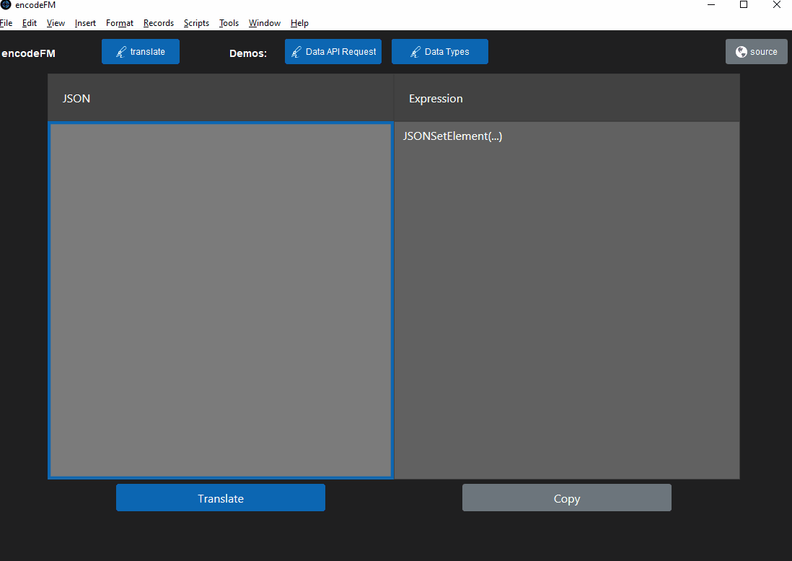

# encodeFM

A FileMaker tool to convert JSON syntax into the FileMaker JSONSetElement syntax



## Translate

Paste in a any JSON formated text and Click Translate

- 'Translate' button in the webviewer performs the main duties of converting the JSON ( all versions of FM that support a webviewer )
- the Translate at the top of the application makes use of the Perform Javascript in WebViewer step ( FM 19 + )

## Development

this project uses [Parcel](https://parceljs.org/getting_started.html) to build. I highly recomend taking the time to set up a parcel build as it saves soo much time in development.

> npm install

> npm run dev

In a browser, go to http://localhost:1234/

Page will resfresh live as you update and save your code.

## Build

this may build a lot of files into a `dist/` folder, however the index.html file in this folder will contain all the javascript, css and html inlined into a single file. This build file is the added to the `html` field in the Web Direct Source Layout for encodeFM.

> npm run build

- dist/index.html ( inlined html, css, javascript )
- put contents into encodeFM::html

## Plug

check out www.ausom.dev for more information and other tools coming soon!

## Samples

checkout

Data API Request Example

```
{
   "layouts":"Projects",
   "limit":25,
   "offset":5,
   "query":[
      {
         "Status":"Active",
         "AssignedTo":"Ricky"
      }
   ],
   "sort":[
      {
         "fieldName":"Priority",
         "sortOrder":"ascend"
      }
   ]
}
```

---

Test with different Types

```
{
    "Null": null,
    "True": true,
    "False": false,
    "Empty": "",
    "Text": "Test Text",
    "Number": 420,
    "ObjectEmpty": {},
    "Object": {"A":1, "b":"two"},
    "ArrayNested": [1,"two",{"A":1, "b":"two"},[1,2,"three"]],
    "ArrayStrings": ["one","two","three"],
    "ArrayNumber": [1,2,3],
    "ArrayEmpty": []
}
```
